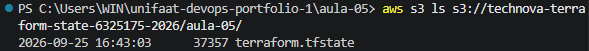
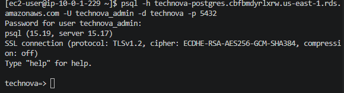
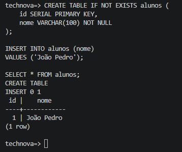
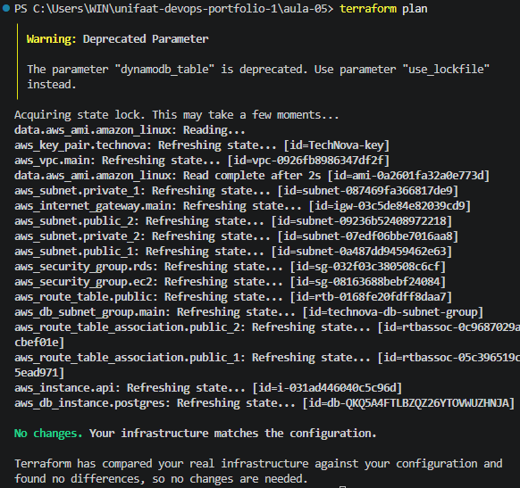

# Aula 05 — RDS PostgreSQL e Remote State

**Aluno:** João Pedro Paulino Ferreira  
**RA:** 6325175  
**Disciplina:** DevOps  
**Instituição:** UniFAAT  
**Ano/Semestre:** 2026-2

---

## Objetivo

Implementar uma infraestrutura AWS utilizando **Terraform**, contemplando:

- VPC com CIDR `10.0.0.0/16`;
- Subnets públicas e privadas distribuídas em duas Availability Zones;
- Instância EC2 pública;
- Banco de dados PostgreSQL utilizando Amazon RDS;
- RDS localizado em subnets privadas;
- Security Groups para comunicação entre EC2 e RDS;
- Remote State utilizando Amazon S3;
- Locking do Terraform State utilizando DynamoDB;
- Validação da comunicação entre EC2 e RDS;
- Validação da persistência de dados no PostgreSQL.

---

## Infraestrutura

### VPC

A infraestrutura utiliza uma VPC com as seguintes configurações:

| Configuração | Valor |
|---|---|
| CIDR | `10.0.0.0/16` |
| DNS Support | Habilitado |
| DNS Hostnames | Habilitado |
| Internet Gateway | Configurado |

### Subnets

Foram configuradas quatro subnets, distribuídas em duas Availability Zones:

| Subnet | CIDR | Tipo | Availability Zone |
|---|---|---|---|
| Public 1 | `10.0.1.0/24` | Pública | `us-east-1a` |
| Private 1 | `10.0.2.0/24` | Privada | `us-east-1a` |
| Public 2 | `10.0.3.0/24` | Pública | `us-east-1b` |
| Private 2 | `10.0.4.0/24` | Privada | `us-east-1b` |

As subnets públicas possuem rota para o Internet Gateway.

As subnets privadas são utilizadas pelo RDS.

---

## EC2

Foi provisionada uma instância EC2 em uma subnet pública para permitir a validação da comunicação com o banco de dados.

### Configurações

| Configuração | Valor |
|---|---|
| Instância | `t2.micro` |
| Sistema operacional | Amazon Linux 2023 |
| Subnet | Pública |
| IP público | Habilitado |
| SSH | Porta `22` |
| Aplicação | Porta `3000` |
| Cliente PostgreSQL | Instalado |

Durante o provisionamento, o `user_data` instala:

```bash
dnf update -y
dnf install -y nodejs
dnf install -y git
dnf install -y postgresql15
```

A versão do cliente PostgreSQL validada na EC2 foi:

```text
psql (PostgreSQL) 15.19
```

---

## RDS PostgreSQL

O banco de dados foi provisionado utilizando o Amazon RDS.

### Configurações

| Configuração | Valor |
|---|---|
| Engine | PostgreSQL |
| Versão | 15 |
| Classe | `db.t3.micro` |
| Armazenamento | 20 GB |
| Tipo de armazenamento | `gp2` |
| Multi-AZ | Não |
| Acesso público | Não |
| Criptografia | Habilitada |
| Porta | `5432` |
| Banco de dados | `technova` |

O RDS utiliza um **DB Subnet Group** composto pelas duas subnets privadas.

A configuração abaixo mantém o banco sem acesso direto pela Internet:

```hcl
publicly_accessible = false
```

---

## Security Groups

### EC2

O Security Group da EC2 permite:

| Porta | Protocolo | Finalidade |
|---|---|---|
| `22` | TCP | SSH |
| `3000` | TCP | Aplicação |

### RDS

O Security Group do RDS permite acesso ao PostgreSQL através da porta:

```text
5432
```

O acesso foi autorizado dentro da VPC:

```text
10.0.0.0/16
```

Dessa forma, a EC2 consegue acessar o RDS através da rede privada da VPC.

---

## Remote State

O Terraform foi configurado para utilizar o **Amazon S3** como armazenamento remoto do Terraform State.

### Bucket S3

```text
technova-terraform-state-6325175-2026
```

O State é armazenado no seguinte caminho:

```text
aula-05/terraform.tfstate
```

### Backend Terraform

```hcl
terraform {
  backend "s3" {
    bucket         = "technova-terraform-state-6325175-2026"
    key            = "aula-05/terraform.tfstate"
    region         = "us-east-1"
    encrypt        = true
    dynamodb_table = "technova-terraform-lock-6325175-2026"
  }
}
```

### Segurança do Bucket

O bucket foi configurado com:

- criptografia AES256;
- versionamento;
- bloqueio de acesso público;
- `BlockPublicAcls`;
- `IgnorePublicAcls`;
- `BlockPublicPolicy`;
- `RestrictPublicBuckets`.

---

## DynamoDB — State Lock

Foi criada uma tabela DynamoDB para realizar o locking do Terraform State.

```text
technova-terraform-lock-6325175-2026
```

A tabela utiliza a chave:

```text
LockID
```

com tipo:

```text
String
```

O locking evita que diferentes execuções do Terraform alterem o State simultaneamente.

---

# Evidências

## 1. State armazenado no S3

A existência do Terraform State no bucket foi validada utilizando:

```bash
aws s3 ls s3://technova-terraform-state-6325175-2026/aula-05/
```

Resultado:


```text
2026-09-25 16:43:03      37357 terraform.tfstate
```

Esse resultado confirma que o Terraform State está armazenado no Amazon S3.

---

## 2. Conexão EC2 → RDS

Após acessar a EC2 por SSH:

```text
[ec2-user@ip-10-0-1-229 ~]$
```


foi executado o cliente PostgreSQL:

```bash
psql -h technova-postgres.cbfbmdyrlxrw.us-east-1.rds.amazonaws.com \
     -U technova_admin \
     -d technova \
     -p 5432
```

A conexão foi estabelecida com sucesso:

```text
psql (15.19, server 15.17)
SSL connection (protocol: TLSv1.2, cipher: ECDHE-RSA-AES256-GCM-SHA384, compression: off)
Type "help" for help.

technova=>
```

Isso comprova a comunicação entre a EC2 e o RDS através da porta `5432`.

---

## 3. Persistência de Dados

Após estabelecer a conexão com o banco, foi criada a tabela:

```sql
CREATE TABLE IF NOT EXISTS alunos (
    id SERIAL PRIMARY KEY,
    nome VARCHAR(100) NOT NULL
);
```

Em seguida, foi inserido um registro:

```sql
INSERT INTO alunos (nome)
VALUES ('João Pedro');
```

O resultado foi:

```text
CREATE TABLE
INSERT 0 1

 id |    nome
----+------------
  1 | João Pedro
(1 row)
```

A conexão foi encerrada.

Posteriormente, uma nova conexão foi estabelecida e executada a consulta:

```sql
SELECT * FROM alunos;
```

O registro continuou disponível:

```text
 id |    nome
----+------------
  1 | João Pedro
(1 row)
```

Isso comprova a persistência dos dados no RDS.

---

## 4. Terraform Plan

Após o provisionamento da infraestrutura, foi executado:

```bash
terraform plan
```

O resultado foi:

```text
No changes. Your infrastructure matches the configuration.

Terraform has compared your real infrastructure against your configuration
and found no differences, so no changes are needed.
```

Esse resultado indica que a infraestrutura existente está de acordo com a configuração declarada no Terraform.

---

# Outputs

Os principais outputs retornados pelo Terraform foram:

```text
dynamodb_lock_table = "technova-terraform-lock-6325175-2026"

ec2_public_dns = "ec2-3-94-247-200.compute-1.amazonaws.com"

ec2_public_ip = "3.94.247.200"

rds_database = "technova"

rds_endpoint = "technova-postgres.cbfbmdyrlxrw.us-east-1.rds.amazonaws.com"

rds_port = 5432

s3_state_bucket = "technova-terraform-state-6325175-2026"

vpc_id = "vpc-0926fb8986347df2f"
```

---

# Variáveis Sensíveis

As credenciais do banco de dados são fornecidas através de variáveis Terraform.

O arquivo:

```text
terraform.tfvars
```

não é versionado no Git.

Ele está incluído no `.gitignore` para evitar o envio de credenciais para o repositório.

Também não são versionados:

```text
.terraform/
*.tfstate
*.tfstate.*
*.pem
technova-key
technova-key.pub
```

---

# Estrutura do Projeto

A estrutura principal da Aula 05 é:

```text
aula-05/
├── backend.tf
├── bootstrap.tf
├── main.tf
├── outputs.tf
├── providers.tf
├── variables.tf
├── terraform.tfvars
├── terraform.tfvars.example
├── .gitignore
└── README.md
     └── README.md
```

## Descrição dos arquivos

| Arquivo | Função |
|---|---|
| `main.tf` | Recursos principais da infraestrutura |
| `providers.tf` | Provider AWS e configurações do Terraform |
| `variables.tf` | Variáveis utilizadas pela infraestrutura |
| `outputs.tf` | Outputs dos recursos |
| `backend.tf` | Configuração do Remote State |
| `bootstrap.tf` | Documentação do processo de criação do backend |
| `terraform.tfvars` | Valores locais e sensíveis |
| `terraform.tfvars.example` | Exemplo das variáveis necessárias |
| `.gitignore` | Arquivos que não devem ser versionados |
| `README.md` | Documentação da atividade |

---

# Ajustes e Decisões

Durante a implementação foram realizados alguns ajustes em relação à configuração inicial.

## Remote State

O bucket S3 e a tabela DynamoDB precisam existir antes da inicialização do backend do Terraform.

Por esse motivo, esses recursos foram criados previamente utilizando AWS CLI.

O arquivo `bootstrap.tf` foi mantido apenas como documentação desse processo.

## DB Subnet Group

O RDS foi configurado utilizando um DB Subnet Group composto pelas duas subnets privadas:

- `10.0.2.0/24` — `us-east-1a`;
- `10.0.4.0/24` — `us-east-1b`.

O nome do DB Subnet Group foi mantido em letras minúsculas para atender às restrições de nomenclatura do Amazon RDS.

## Credenciais

As credenciais do PostgreSQL são fornecidas através de variáveis sensíveis e não são armazenadas no repositório Git.

## DynamoDB

O DynamoDB foi mantido para atender ao requisito da atividade de utilização de locking do Terraform State, apesar do aviso de depreciação apresentado pela versão atual do Terraform.

---

# Limpeza da Infraestrutura

Após a coleta das evidências, a infraestrutura principal poderá ser removida utilizando:

```bash
terraform destroy
```

O bucket S3 e a tabela DynamoDB utilizados pelo Remote State são recursos externos ao conjunto principal de recursos gerenciados pelo Terraform desta atividade.

Por isso, eles não fazem parte do `terraform destroy` da infraestrutura principal.

---

# Conclusão

A atividade implementou uma infraestrutura AWS utilizando Terraform, contemplando:

- VPC `10.0.0.0/16`;
- subnets públicas e privadas em duas Availability Zones;
- EC2 `t2.micro`;
- RDS PostgreSQL 15 `db.t3.micro`;
- Security Groups;
- DB Subnet Group;
- Remote State utilizando Amazon S3;
- locking utilizando DynamoDB;
- comunicação EC2 → RDS;
- persistência de dados no PostgreSQL;
- validação final utilizando `terraform plan`.

As principais funcionalidades da infraestrutura foram validadas por meio de comandos AWS CLI, conexão SSH, conexão PostgreSQL, operações de leitura e escrita no banco e execução do `terraform plan`.